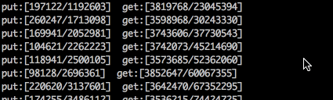

# CxxJDK
##C++ library like JDK.
<br/>
*chinese version: [简体中文](README.zh_cn.md)*

### Table of Contents
  - [Characteristics](characteristics)
  - [Example](#example)
  - [Performance](#performance)
  - [Features](#features)
  - [Manual](#manual)
  - [TODO](#todo)
  - [Support](#support)

####Characteristics
* Cross platform: support Linux32/64, OSX64, Win64 platforms;
* High performance: with the advantages of C/C++ and Java concurrent Libraries tegother, bursting performance;
* Class rich: to achieve JDK rich class library, get rid of the plight of the poor class library C++;
* Easy to develop: first, use the java development, and then use the `CxxJDK` for translation, So easy!

####Example
`java:`

```
public static void main(String[] args) {
	class Worker implements Runnable {

		@Override
		public void run() {
			try {
				Thread.sleep(1000);
			} catch (InterruptedException e) {
				e.printStackTrace();
			}
			System.out.println(String.format("thread %d finished", 
				this.hashCode()));
		}
	}

    ThreadPoolExecutor executor = new ThreadPoolExecutor(100, 200, 10, 
			TimeUnit.SECONDS, new LinkedBlockingQueue<Runnable>());   
	executor.allowCoreThreadTimeOut(true);
	
	for (int i = 0; i < 200; i++) {   
		executor.execute(new Worker());   
	}
	
	executor.shutdown();
}
```

`c++:`

```
int main(int argc, const char **argv) {
	ESystem::init(argc, argv); //cxxjdk init!

	class Worker : public ERunnable {
	public:
		virtual void run() {
			try {   
				EThread::sleep(1000);   
			} catch (EInterruptedException& e) {   
				e.printStackTrace();   
			}   
			ESystem::out->println(EString::formatOf("thread %d finished", 
				this->hashCode()).c_str());
		}
	};

	EThreadPoolExecutor* executor = new EThreadPoolExecutor(100, 200, 10,
			ETimeUnit::SECONDS, new ELinkedBlockingQueue<ERunnable>());
	executor->allowCoreThreadTimeOut(true);
	
	for (int i = 0; i < 200; i++) {
		executor->execute(new Worker());
	}
	
	executor->shutdown();
	executor->awaitTermination();
	
	delete executor; //object free!
}
```

The above example is attractive enough? YES.

more examples:  
[testefc.cpp](test/testefc.cpp)  
[testnio.cpp](test/testnio.cpp)  
[testbon.cpp](test/testbon.cpp)  
[testc11.cpp](test/testc11.cpp)

####Performance
EConcurrentHashmap Test: 

`software environment:`

```
put 20 threads && get 20 threads.
```

`hardware environment:`

```
Model Name:				MacBook Pro
Model Identifier:		MacBookPro10,2
Processor Speed:		2.6 GHz
Number of Processors:	1
Total Number of Cores:	2
```
`test results:`



####Features

######base:

| jdk class | cxxjdk class |
| ----- | ----- |
|	Object[]                        |  EA                              |
|	AbstractCollection              |  EAbstractCollection             |
|	AbstractList                    |  EAbstractList                   |
|	AbstractMap                     |  EAbstractMap                    |
|	AbstractQueue                   |  EAbstractQueue                  |
|	AbstractSet                     |  EAbstractSet                    |
|	AlreadyBoundException           |  EAlreadyBoundException          |
|   ArithmeticException             |  EArithmeticException            |
|	Array                           |  EArray                          |
|	ArrayDeque                      |  EArrayDeque                     |
|	ArrayList                       |  EArrayList                      |
|	Arrays                          |  EArrays                         |
|	AuthenticationException         |  EAuthenticationException        |
|	Base64                          |  EBase64                         |
|	BindException                   |  EBindException                  |
|	BitSet                          |  EBitSet                         |
|	Bits                            |  EBits                           |
|	Boolean                         |  EBoolean                        |
|	BufferedInputStream             |  EBufferedInputStream            |
|	BufferedOutputStream            |  EBufferedOutputStream           |
|	Byte                            |  EByte                           |
|	ByteArrayInputStream            |  EByteArrayInputStream           |
|	ByteArrayOutputStream           |  EByteArrayOutputStream          |
|	CRC32                           |  ECRC32                          |
|	Calendar                        |  ECalendar                       |
|	Character                       |  ECharacter                      |
|	CheckedInputStream              |  ECheckedInputStream             |
|	Checksum                        |  EChecksum                       |
|	ClassCastException              |  EClassCastException             |
|	Collection                      |  ECollection                     |
|	Collections                     |  ECollections                    |
|	Comparable                      |  EComparable                     |
|	Comparator                      |  EComparator                     |
|	Condition                       |  ECondition                      |
|	ConnectException                |  EConnectException               |
|	DataFormatException             |  EDataFormatException            |
|	DatagramPacket                  |  EDatagramPacket                 |
|	DatagramSocket                  |  EDatagramSocket                 |
|	DataInput                       |  EDataInput                      |
|	DataInputStream                 |  EDataInputStream                |
|	DataOutput                      |  EDataOutput                     |
|	DataOutputStream                |  EDataOutputStream               |
|	Date                            |  EDate                           |
|	Deflater                        |  EDeflater                       |
|	DeflaterOutputStream            |  EDeflaterOutputStream           |
|	Deque                           |  EDeque                          |
|	Dictionary                      |  EDictionary                     |
|	Double                          |  EDouble                         |
|	EOFException                    |  EEOFException                   |
|	EmptyStackException             |  EEmptyStackException            |
|	Enumeration                     |  EEnumeration                    |
|	EventListener                   |  EEventListener                  |
|	EventListenerProxy              |  EEventListenerProxy             |
|	EventObject                     |  EEventObject                    |
|	Exception                       |  EException                      |
|	File                            |  EFile                           |
|	FileInputStream                 |  EFileInputStream                |
|	FileNotFoundException           |  EFileNotFoundException          |
|	FileOutputStream                |  EFileOutputStream               |
|	FilenameFilter                  |  EFilenameFilter                 |
|	FilterInputStream               |  EFilterInputStream              |
|	FilterOutputStream              |  EFilterOutputStream             |
|	Float                           |  EFloat                          |
|	GZIPInputStream                 |  EGZIPInputStream                |
|	GZIPOutputStream                |  EGZIPOutputStream               |
|	HashMap                         |  EHashMap                        |
|	HashSet                         |  EHashSet                        |
|	IOException                     |  EIOException                    |
|	IPAddressUtil                   |  EIPAddressUtil                  |
|	IdentityHashMap                 |  EIdentityHashMap                |
|	IllegalArgumentException        |  EIllegalArgumentException       |
|	IllegalStateException           |  EIllegalStateException          |
|	IllegalThreadStateException     |  EIllegalThreadStateException    |
|	IndexOutOfBoundsException       |  EIndexOutOfBoundsException      |
|	InetAddress                     |  EInetAddress                    |
|	InetSocketAddress               |  EInetSocketAddress              |
|	Inflater                        |  EInflater                       |
|	InflaterInputStream             |  EInflaterInputStream            |
|	InputStream                     |  EInputStream                    |
|	Integer                         |  EInteger                        |
|	InterfaceAddress                |  EInterfaceAddress               |
|	InterruptedException            |  EInterruptedException           |
|	InterruptedIOException          |  EInterruptedIOException         |
|	Interruptible                   |  EInterruptible                  |
|	Iterable                        |  EIterable                       |
|	Iterator                        |  EIterator                       |
|	LLong                           |  ELLong                          |
|	LinkedList                      |  ELinkedList                     |
|	List                            |  EList                           |
|	ListIterator                    |  EListIterator                   |
|	Lock                            |  ELock                           |
|	MalformedURLException           |  EMalformedURLException          |
|	Map                             |  EMap                            |
|	MatchResult                     |  EMatchResult                    |
|	Matcher                         |  EMatcher                        |
|	Math                            |  EMath                           |
|	MathFP                          |  EMathFP                         |
|	MulticastSocket                 |  EMulticastSocket                |
|	NavigableMap                    |  ENavigableMap                   |
|	NavigableSet                    |  ENavigableSet                   |
|	NetworkInterface                |  ENetworkInterface               |
|	NoRouteToHostException          |  ENoRouteToHostException         |
|	NoSuchElementException          |  ENoSuchElementException         |
|	NotYetBoundException            |  ENotYetBoundException           |
|	NullPointerException            |  ENullPointerException           |
|	Number                          |  ENumber                         |
|	NumberFormatException           |  ENumberFormatException          |
|	Object                          |  EObject                         |
|	Observable                      |  EObservable                     |
|	Observer                        |  EObserver                       |
|	OutOfMemoryError                |  EOutOfMemoryError               |
|	OutputStream                    |  EOutputStream                   |
|	Pattern                         |  EPattern                        |
|	PatternSyntaxException          |  EPatternSyntaxException         |
|	PipedInputStream                |  EPipedInputStream               |
|	PipedOutputStream               |  EPipedOutputStream              |
|	PortUnreachableException        |  EPortUnreachableException       |
|	PrintStream                     |  EPrintStream                    |
|	PriorityQueue                   |  EPriorityQueue                  |
|	Process                         |  EProcess                        |
|	ProtocolException               |  EProtocolException              |
|	Queue                           |  EQueue                          |
|	Random                          |  ERandom                         |
|	RandomAccessFile                |  ERandomAccessFile               |
|	Reference                       |  EReference                      |
|	Runnable                        |  ERunnable                       |
|	Runtime                         |  ERuntime                        |
|	RuntimeException                |  ERuntimeException               |
|	SaslException                   |  ESaslException                  |
|	SecureRandom                    |  ESecureRandom                   |
|	SecurityException               |  ESecurityException              |
|	Sentry                          |  ESentry                         |
|	SequenceInputStream             |  ESequenceInputStream            |
|	ServerSocket                    |  EServerSocket                   |
|	Set                             |  ESet                            |
|	Socket                          |  ESocket                         |
|	SocketException                 |  ESocketException                |
|	SocketOptions                   |  ESocketOptions                  |
|	SocketTimeoutException          |  ESocketTimeoutException         |
|	SortedMap                       |  ESortedMap                      |
|	SortedSet                       |  ESortedSet                      |
|	Stack                           |  EStack                          |
|	String                          |  EString                         |
|	StringTokenizer                 |  EStringTokenizer                |
|	System                          |  ESystem                         |
|	Thread                          |  EThread                         |
|	ThreadGroup                     |  EThreadGroup                    |
|	ThreadLocal                     |  EThreadLocal                    |
|	ThreadLocalStorage              |  EThreadLocalStorage             |
|	Throwable                       |  EThrowable                      |
|	TimeUnit                        |  ETimeUnit                       |
|	Timer                           |  ETimer                          |
|	TimerTask                       |  ETimerTask                      |
|	TreeMap                         |  ETreeMap                        |
|	TreeSet                         |  ETreeSet                        |
|	URI                             |  EURI                            |
|	URISyntaxException              |  EURISyntaxException             |
|	URLDecoder                      |  EURLDecoder                     |
|	URLEncoder                      |  EURLEncoder                     |
|	URLString                       |  EURLString                      |
|	UnknownHostException            |  EUnknownHostException           |
|	UnknownServiceException         |  EUnknownServiceException        |
|	UnsupportedAddressTypeException |  EUnsupportedAddressTypeException |
|	UnsupportedEncodingException    |  EUnsupportedEncodingException   |
|	UnsupportedOperationException   |  EUnsupportedOperationException  |
|	Vector                          |  EVector                         |
|	try {xxx} finally {yyy}         |  ON_FINALLY_NOTHROW(yyy) {xxx}   |

                    
######concurrent:

| jdk class | cxxjdk class |
| ----- | ----- |
| synchronized                              |  SYNCHRONIZED                    |
| AbstractConcurrentCollection              |   EAbstractConcurrentCollection        |
| AbstractConcurrentQueue                   |   EAbstractConcurrentQueue             |
| AbstractExecutorService                   |   EAbstractExecutorService             |
| AbstractOwnableSynchronizer               |   EAbstractOwnableSynchronizer         |
| AbstractQueuedSynchronizer                |   EAbstractQueuedSynchronizer          |
| AtomicBoolean                             |   EAtomicBoolean                       |
| AtomicCounter                             |   EAtomicCounter                       |
| AtomicInteger                             |   EAtomicInteger                       |
| AtomicLLong                               |   EAtomicLLong                         |
| AtomicReference                           |   EAtomicReference                     |
| BlockingQueue                             |   EBlockingQueue                       |
| BrokenBarrierException                    |   EBrokenBarrierException              |
| Callable                                  |   ECallable                            |
| CancellationException                     |   ECancellationException               |
| CompletionService                         |   ECompletionService                   |
| ConcurrentHashMap                         |   EConcurrentHashMap                   |
| ConcurrentLinkedQueue                     |   EConcurrentLinkedQueue               |
| ConcurrentModificationException           |   EConcurrentModificationException     |
| ConcurrentNavigableMap                    |   EConcurrentNavigableMap              |
| ConcurrentSkipListMap                     |   EConcurrentSkipListMap               |
| CopyOnWriteArrayList                      |   ECopyOnWriteArrayList                |
| CountDownLatch                            |   ECountDownLatch                      |
| CyclicBarrier                             |   ECyclicBarrier                       |
| Exchanger                                 |   EExchanger                           |
| ExecutionException                        |   EExecutionException                  |
| Executor                                  |   EExecutor                            |
| ExecutorCompletionService                 |   EExecutorCompletionService           |
| ExecutorService                           |   EExecutorService                     |
| Executors                                 |   EExecutors                           |
| Future                                    |   EFuture                              |
| FutureTask                                |   EFutureTask                          |
| LinkedBlockingQueue                       |   ELinkedBlockingQueue                 |
| LinkedTransferQueue                       |   ELinkedTransferQueue                 |
| LockSupport                               |   ELockSupport                         |
| ReadWriteLock                             |   EReadWriteLock                       |
| ReentrantLock                             |   EReentrantLock                       |
| ReentrantReadWriteLock                    |   EReentrantReadWriteLock              |
| RejectedExecutionException                |   ERejectedExecutionException          |
| RejectedExecutionHandler                  |   ERejectedExecutionHandler            |
| RunnableFuture                            |   ERunnableFuture                      |
| Semaphore                                 |   ESemaphore                           |
| SynchronousQueue                          |   ESynchronousQueue                    |
| ThreadFactory                             |   EThreadFactory                       |
| ThreadLocalRandom                         |   EThreadLocalRandom                   |
| ThreadPoolExecutor                        |   EThreadPoolExecutor                  |
| TimeoutException                          |   ETimeoutException                    |
| TransferQueue                             |   ETransferQueue                       |
| Unsafe                                    |   EUnsafe                              |
| Collection*                               |   EConcurrentCollection                |
| Enumeration*                              |   EConcurrentEnumeration               |
| Iterator*                                 |   EConcurrentIterator                  |
| List*                                     |   EConcurrentList                      |
| Map*                                      |   EConcurrentMap                       |
| ListIterator*                             |   EConcurrentListIterator              |
| NavigableSet*                             |   EConcurrentNavigableSet              |
| Queue*                                    |   EConcurrentQueue                     |
| Set*                                      |   EConcurrentSet                       |
| SortedMap*                                |   EConcurrentSortedMap                 |
| SortedSet*                                |   EConcurrentSortedSet                 |
| Object[]*                                 |   ESharedArr                           |
| ArrayList*                                |   ESharedArrLst                        |


######nio:

| jdk class | cxxjdk class |
| ----- | ----- |
| AlreadyConnectedException       |  EAlreadyConnectedException         |
| AsynchronousCloseException      |  EAsynchronousCloseException        |
| BufferOverflowException         |  EBufferOverflowException           |
| BufferUnderflowException        |  EBufferUnderflowException          |
| ByteChannel                     |  EByteChannel                       |
| CancelledKeyException           |  ECancelledKeyException             |
| Channel                         |  EChannel                           |
| ChannelInputStream              |  EChannelInputStream                |
| ClosedByInterruptException      |  EClosedByInterruptException        |
| ClosedChannelException          |  EClosedChannelException            |
| ClosedSelectorException         |  EClosedSelectorException           |
| ConnectionPendingException      |  EConnectionPendingException        |
| DatagramChannel                 |  EDatagramChannel                   |
| FileChannel                     |  EFileChannel                       |
| FileLock                        |  EFileLock                          |
| xxByteBuffer                    |  EIOByteBuffer                      |
| IllegalBlockingModeException    |  EIllegalBlockingModeException      |
| InterruptibleChannel            |  EInterruptibleChannel              |
| InvalidMarkException            |  EInvalidMarkException              |
| MappedByteBuffer                |  EMappedByteBuffer                  |
| MembershipKey                   |  EMembershipKey                     |
| MulticastChannel                |  EMulticastChannel                  |
| NativeThreadSet                 |  ENativeThreadSet                   |
| NoConnectionPendingException    |  ENoConnectionPendingException      |
| NonReadableChannelException     |  ENonReadableChannelException       |
| NonWritableChannelException     |  ENonWritableChannelException       |
| NotYetConnectedException        |  ENotYetConnectedException          |
| OverlappingFileLockException    |  EOverlappingFileLockException      |
| ReadOnlyBufferException         |  EReadOnlyBufferException           |
| SelectableChannel               |  ESelectableChannel                 |
| SelectionKey                    |  ESelectionKey                      |
| Selector                        |  ESelector                          |
| ServerSocketChannel             |  EServerSocketChannel               |
| SocketChannel                   |  ESocketChannel                     |
| UnresolvedAddressException      |  EUnresolvedAddressException        |


######other:

| cxxjdk class | class description |
| ----- | ----- |
| EConfig               | Foundation for application configuration |
| EByteBuffer           | Byte array buffer |
| ESharedPtr            | Smart Pointer |
| ELockPool             | SpinLock Pool |
| EOrderAccess          | Memory Access Ordering Model |
| EFork                 | Process system call, only for Unix/Linux system |
| ESimpleCondition      | C++ style condition |
| ESimpleLock           | C++ style mutex lock      |
| ESpinLock             | C++ wrapper for spin lock |
| ESimpleMap            | C++ wrapper for map table |
| ESimpleStack          | C++ wrapper for stack     |
| ESimpleVector         | C++ wrapper for vector    |
| ESimpleEnumeration    | Enumeration for ESimpleXXX|
| EStream               | C++ wrapper for io stream |
| EOS                   | Utils for OS              |
| EAtomic               | C++ wrapper for atomic operation |
| EThreadX              | C++11 wrapper for EThread |
| EScopeGuard           | C++11 assistant for scope guards |

   
####Manual
See [Guide document](doc/Guide.md).

####TODO
    java.security.*;

####Support
Email: [cxxjava@163.com](mailto:cxxjava@163.com)
   
